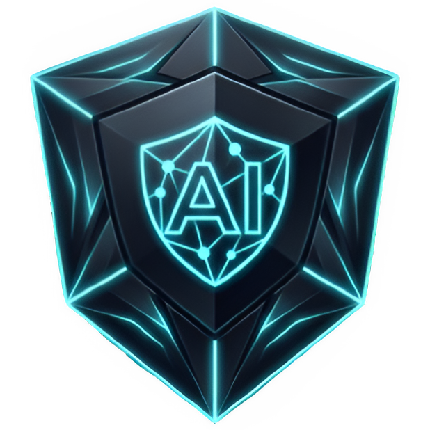

<div align="center">



# AntiRecAI

**Stealth, OBS-Invisible Multi-AI Desktop Overlay with 1-Click Screen Snip & Solve**

[](https://github.com/ZuhuInc/AntiRecAI)
[](https://www.electronjs.org/)
[](https://nodejs.org/)
[](LICENSE)

*Seamlessly overlay Google Gemini, OpenAI ChatGPT, Anthropic Claude, and custom AI services directly on your desktop — completely hidden from OBS Studio, Discord screen share, Teams, Zoom, and video capture.*

</div>

---

## Key Highlights

- **Hardware Screen Protection (`WDA_EXCLUDEFROMCAPTURE`)**: Uses low-level Windows DWM display affinity so the overlay is **100% visible and interactive to your physical eyes**, but renders completely transparent and invisible on OBS Studio, Discord screen shares, and video recordings.
- **1-Click Screen Snip & Solve**: Press a single hotkey (such as `Ctrl+Shift+S`, `Mouse4`, or `Mouse5`) to automatically capture your display into memory, attach it to your active AI prompt, inject your custom instruction, and submit immediately.
- **Universal Multi-AI Switcher**: Switch seamlessly between **Google Gemini**, **ChatGPT**, **Claude**, or connect any **Custom AI Service URL** directly via the top navigation bar.
- **Full Mouse Button & Keybind Customization**: Bind hotkeys to **Mouse 4**, **Mouse 5**, **Mouse 3 (Middle Click)**, or any keyboard combination with modifiers (`Ctrl`, `Alt`, `Shift`).
- **Stealth Overlay Controls**:
  - **Smooth Opacity Slider** (20% – 100%).
  - **Anti-OBS Stealth Mode Switch** (instant enable / disable).
  - **Always-on-Top Window Pinning**.
  - **Zero Taskbar Footprint** (runs discretely in the Windows notification area / System Tray).
- **Persistent Workspace Authentication**: Dedicated partition storage (`persist:gemini_session`) keeps you logged into your Google, OpenAI, and Claude accounts across system restarts.

---

## Global Shortcuts

All shortcuts can be reconfigured inside the **Settings** panel:

| Action | Default Binding | Alternate Mouse Bindings | Description |
| :--- | :--- | :--- | :--- |
| **Toggle Overlay** | `Ctrl + Shift + H` | `Mouse4` / `Mouse5` / `Mouse3` | Instantly shows or hides the overlay window. |
| **Snip & Solve** | `Ctrl + Shift + S` | `Ctrl + Mouse4` / Custom | Captures screen to memory, attaches to prompt, types instruction, and submits. |
| **Emergency Exit** | `Ctrl + Shift + End` | `Alt + Mouse5` / Custom | Immediately terminates and exits the application process. |

---

## Getting Started

### Prerequisites
- **Operating System**: Windows 10 (Version 2004+) or Windows 11
- **Runtime Environment**: [Node.js](https://nodejs.org/) (v18 or higher recommended)

### 1. Clone & Install
```bash
git clone https://github.com/ZuhuInc/AntiRecAI.git
cd AntiRecAI
npm install
```

### 2. Start Application
```bash
npm start
```
- The overlay will launch docked neatly on the right side of your primary monitor.
- To reveal or hide the overlay at any time, press **`Ctrl + Shift + H`** or click the tray icon in the taskbar notification area.

---

## Building Standalone Executables

AntiRecAI includes build scripts to generate standalone, signed Windows binaries:

### Build All (Installer + Portable):
```bash
npm run build:all
```

### Build Specific Package:
- **Portable Single-File Executable**:
  ```bash
  npm run build:portable
  ```
  *Output: `dist/AntiRecAI-Portable-1.0.0.exe` (Zero installation required, run from anywhere).*

- **Windows Setup Installer**:
  ```bash
  npm run build:installer
  ```
  *Output: `dist/AntiRecAI Setup 1.0.0.exe` (Full NSIS installer with desktop and Start Menu shortcuts).*

---

## Verifying OBS / Screen Share Invisibility

To verify that AntiRecAI is properly excluded from screen captures:

1. Launch **OBS Studio**.
2. Add a **Display Capture** source targeting your active monitor.
3. In the Display Capture properties, make sure the **Capture Method** is set to:
   - **"Windows 10 (1903 and up)"** (Windows Graphics Capture / WGC).
4. Bring up AntiRecAI on your screen.
5. **Observation**: While the overlay is fully visible to your physical eyes, the OBS Studio canvas captures everything *behind* AntiRecAI with no trace of the overlay.

---

## Repository Structure

```
AntiRecAI/
├── assets/
│   ├── IconMain.png         # Main application & tray icon
│   ├── gemini.svg           # Google Gemini vector tab icon
│   ├── chatgpt.svg          # OpenAI ChatGPT vector tab icon
│   └── claude.svg           # Anthropic Claude vector tab icon
├── dist/                    # Packaged standalone .exe & installer
├── header.html              # Custom draggable titlebar, tabs & settings UI
├── main.js                  # Electron main process, Win32 display affinity & mouse poller
├── preload.js               # Secure IPC bridge
├── stealth-preload.js       # Bot detection masking & Google OAuth header patch
├── package.json             # Build configuration & dependencies
└── README.md                # Project documentation
```

---

## Configuration & Customization

All settings can be customized directly in the UI via the **Settings** panel:
- **Custom Prompt**: Change the automated instruction prompt (default: `"Provide only a short, direct answer: "`).
- **Custom AI URL**: Add any custom web AI service (such as DeepSeek, Perplexity, or a local Ollama WebUI), which dynamically adds a tab directly next to Claude.
- **Opacity / Transparency**: Adjust the window opacity from 20% to 100%.
- **Anti-OBS Switch**: Toggle hardware display exclusion on and off dynamically.
- **Session Reset**: Use *"Clear Cache & Sign Out"* to wipe stored cookies and tokens.

---

## License

This project is licensed under the [MIT License](LICENSE).
